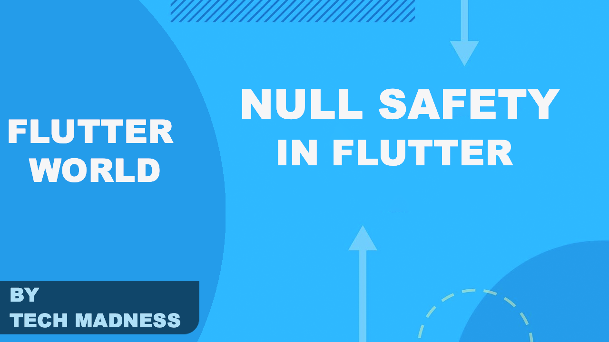

# null_safety_app

As a developer, we always struggle to handle NullPointerException which causes a lot of time and money while developing software. 
 It has been referred to as a billion-dollar mistake. (Wiki)

 

# Article
Flutter Null Safety ([Medium](https://medium.com/flutterworld/flutter-null-safety-5d20012c2441) )

Don't forget to star⭐ and contribute if you want. 

# Requirements
- Any Operating System (ie. MacOS X, Linux, Windows)
- Any IDE with Flutter SDK installed (ie. Android Studio, VSCode etc)
- A little knowledge of Dart and Flutter
 

# Getting Started

This project is a starting point for a Flutter application.

A few resources to get you started if this is your first Flutter project:

- [Lab: Write your first Flutter app](https://flutter.io/docs/get-started/codelab)
- [Cookbook: Useful Flutter samples](https://flutter.io/docs/cookbook)

For help getting started with Flutter, view our 
[online documentation](https://flutter.io/docs), which offers tutorials, 
samples, guidance on mobile development, and a full API reference.
